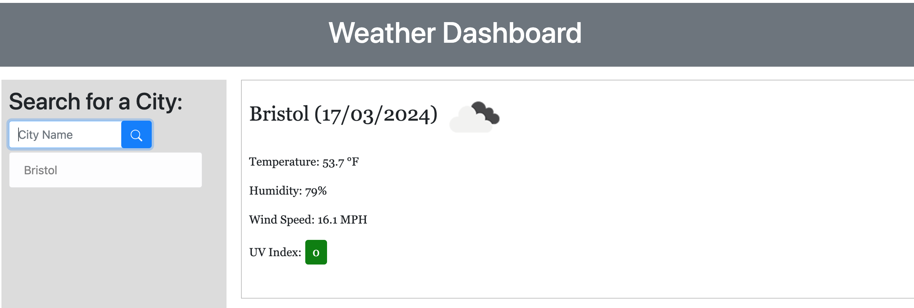
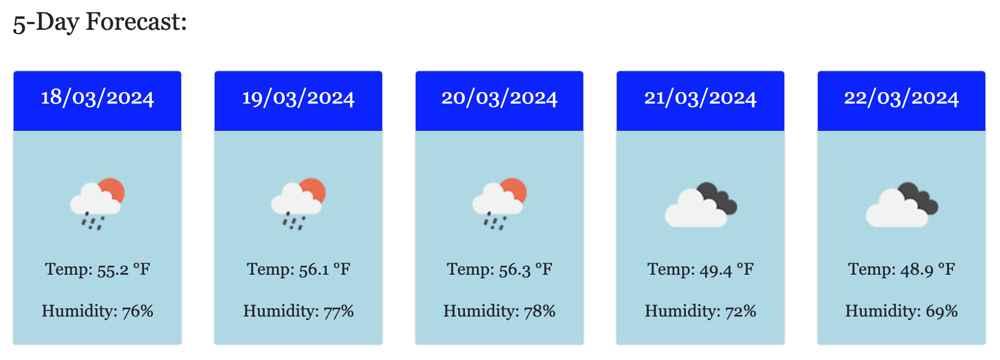

# LiannaTF-Weather-Dashboard

## Description

The task was to create a Weather Dashboard that will run in the browser and allow the user to retrieve data from another application's API and using it in my own application.

### Tasks Completed

* Weather Dashboard with form input created

* Features dynamically updated HTML and CSS

* Uses local storage to store persistent data

* The [5 Day Weather Forecast](https://openweathermap.org/forecast5) used to retrieve weather data for cities

### Links

Deployed website: (https://lianna87.github.io/LiannaTF-Weather-Dashboard/)

Code repository: (https://github.com/Lianna87/LiannaTF-Weather-Dashboard)

#### Usage

The webpage can be viewed in a traditional desktop web browser, table or phone once deployed. 

#### Screenshots

